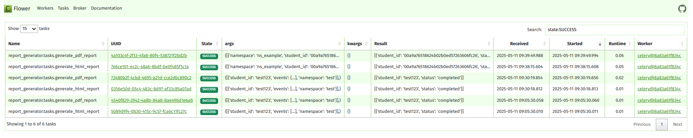

# Feedback Report Generator

A Django-based web application for generating HTML and PDF reports from student feedback data. The application uses Celery for asynchronous task processing, Redis as a message broker, and PostgreSQL as the database.

## Features

- Generate HTML reports from student feedback data
- Generate PDF reports from the same data
- Asynchronous task processing using Celery
- RESTful API endpoints for report generation
- Containerized with Docker for easy deployment
- Monitoring with Flower (Celery monitoring tool)

## Prerequisites

- Docker (v20.10+)
- Docker Compose (v2.0+)

## Getting Started

### 1. Clone the Repository

```bash
git clone <repository-url>
cd feedback_project
```

### 2. Set Up Environment Variables

Copy the example environment file and update the values as needed:

```bash
cp .env.example .env
```

Edit the `.env` file with your preferred settings. The default values should work for local development.

### 3. Start the Application

Build and start the application using Docker Compose:

```bash
docker-compose up --build -d
```

This will start the following services:
- Django web server (port 8000)
- PostgreSQL database (port 5433)
- Redis (port 6379)
- Celery worker
- Celery beat
- Flower (Celery monitoring dashboard on port 5555)

## Monitoring

You can monitor the Celery tasks using the Flower dashboard at `http://localhost:5555`.



The Flower dashboard provides:
- Real-time monitoring of Celery workers and tasks
- Task history and statistics
- Worker status and resource usage
- Ability to view task details and results
- Flower (port 5555)

### 4. Apply Database Migrations

```bash
docker-compose exec web python manage.py migrate
```

### 5. Create a Superuser (Optional)

Create an admin user to access the Django admin interface:

```bash
docker-compose exec web python manage.py createsuperuser
```

## API Endpoints

### Generate HTML Report

**Endpoint:** `POST /assignment/html`

**Request Body:**
```json
[
    {
        "namespace": "ns_example",
        "student_id": "00a9a76518624b02b0ed57263606fc26",
        "events": [
            {
                "type": "saved_code",
                "created_time": "2024-07-21 03:04:55.939000+00:00",
                "unit": "17"
            },
            {
                "type": "saved_code",
                "created_time": "2024-07-21 03:05:27.027000+00:00",
                "unit": "18"
            }
        ]
    }
]
```

**Response:**
```json
{
  "task_id": "<task-id>"
}
```

### Get HTML Report

**Endpoint:** `GET /assignment/html/<task_id>`

**Response:**
```json
{
  "status": "completed",
  "student_id": "00a9a76518624b02b0ed57263606fc26",
  "html": "<h2>Student ID: student123</h2><p>Event Order: Q1 -> Q2</p>"
}
```

### Generate PDF Report

**Endpoint:** `POST /assignment/pdf`

**Request Body:** Same as HTML report

**Response:**
```json
{
  "task_id": "<task-id>"
}
```

### Download PDF Report

**Endpoint:** `GET /assignment/pdf/<task_id>`

**Response:**
- Returns the PDF file as a download

## Accessing the Admin Interface

1. Visit: http://localhost:8000/admin/
2. Log in with your superuser credentials

## Monitoring

### Flower (Celery Monitoring)

Access the Flower dashboard at: http://localhost:5555

## Project Structure

```
feedback_project/
├── core/                   # Django project settings
├── report_generator/       # Main app for report generation
│   ├── migrations/         # Database migrations
│   ├── tasks.py           # Celery tasks
│   ├── views.py           # API views
│   ├── models.py          # Database models
│   └── urls.py            # App URL configurations
├── .env.example           # Example environment variables
├── .dockerignore          # Files to ignore in Docker build
├── docker-compose.yml     # Docker Compose configuration
├── Dockerfile            # Docker configuration
└── pyproject.toml        # Python project dependencies
```

## Development

### Running Tests

To run tests, use:

```bash
docker-compose exec web python manage.py test
```

### Linting

```bash
docker-compose exec web black .
docker-compose exec web isort .
```

## Deployment

For production deployment, make sure to:

1. Set `DEBUG=False` in `.env`
2. Configure proper database credentials
3. Set up a proper web server (Nginx/Apache) with WSGI
4. Configure HTTPS with a valid certificate
5. Set appropriate security headers

## Troubleshooting

### Common Issues

1. **Port conflicts**: If ports 8000, 5433, 6379, or 5555 are in use, update them in `docker-compose.yml`
2. **Database connection issues**: Ensure PostgreSQL is running and credentials in `.env` are correct
3. **Celery worker not starting**: Check the logs with `docker-compose logs celery`

### Viewing Logs

```bash
# View all logs
docker-compose logs -f

# View specific service logs
docker-compose logs -f web
docker-compose logs -f celery
docker-compose logs -f db
```


## Contributing

1. Fork the repository
2. Create a feature branch
3. Commit your changes
4. Push to the branch
5. Create a new Pull Request